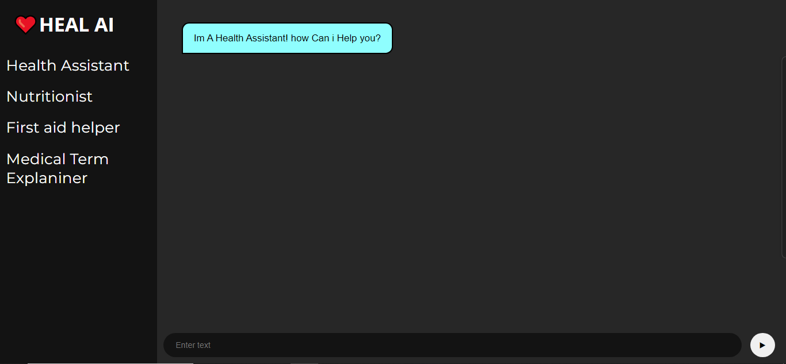

# ❤️ HEAL AI: Your Personal Health Assistant  

**HEAL AI** is an AI-powered, full-stack web application designed to provide quick, intelligent, and accessible healthcare guidance.  
It combines the power of **Google’s Gemini API** with a clean **Flask backend** and an intuitive **HTML/CSS/JS frontend** — making it your 24/7 virtual health companion.  

---

## 👨‍💻 Team — *Stark_Squad*  

| Name | Role |
|:------|:------|
| **Varun Kumar** | Team Lead — Backend Developer & JavaScript |
| **Uday** | Frontend Developer |
| **Gursewak** | Frontend Developer |
| **Hritik** | Overall Assistant  |

---

## 🌟 Features  

### 🧑‍⚕️ Health Assistant  
Ask general health and wellness questions — get AI-powered answers instantly.  

### 🥗 Nutritionist  
Receive diet tips, meal recommendations, and calorie information tailored to your needs.  

### 🩹 First Aid Helper  
Get step-by-step instructions for common first aid and emergency situations.  

### 📖 Medical Term Explainer  
Simplifies complex medical terms into easy-to-understand language.  

---
## ⚙️ Demo
Below is a quick look at the **HEAL AI Interface** 👇  


 

## ⚙️ Project Setup  

### 1️⃣ Clone the Repository  
```bash
git clone https://github.com/Varunkumar2516/Heal_AI.git

```

### 2️⃣ Install Dependencies
```bash
pip install -r requirements.txt
```

### 3️⃣ Start the Flask Server
```bash
python server.py
```

## 🧠 Tech Stack  

| Layer | Technology |
|:------|:------------|
| **Frontend** | HTML, CSS, JavaScript |
| **Backend** | Flask (Python) |
| **API** | Google Gemini (GenAI) |
| **CORS** | Flask-CORS |

## 💡 Future Enhancements  

- 🗣️ **Voice Interaction** — Add speech-to-text and text-to-speech for hands-free use.  
- 🌐 **Multilingual Support** — Expand to multiple languages for broader accessibility.  
- 📱 **Responsive Mobile-Friendly UI** — Ensure smooth usage on all devices.  
- 💾 **User Health Data Dashboard** — Track personal health history and insights.  

---

## 🤝 Contribution  

Contributions are welcome!  
Fork the repository, create your feature branch, and submit a pull request.  

---

## 🧾 License  

Licensed under the **MIT License** — free for personal and academic use.  

---

## ✨ Inspiration  

> “Your health, your AI — HEAL AI.”  
Bringing AI-powered wellness and safety guidance to everyone.  


---

💖 *Created with heart by [Varun Kumar](https://github.com/Varunkumar2516)*  
